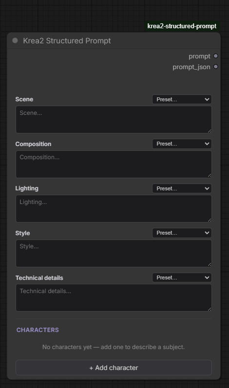
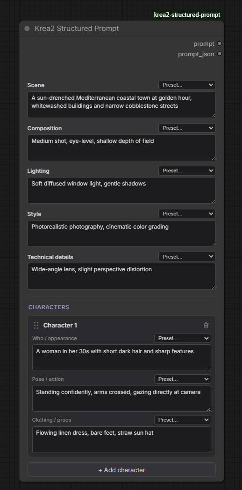

# Krea2 Structured Prompt

[](https://github.com/WaitWut/krea2-structured-prompt/blob/main/LICENSE)

A structured prompt-builder node for [ComfyUI](https://github.com/comfyanonymous/ComfyUI), tuned for **Krea-2 / K2**. Instead of writing freehand prose, you fill in structured fields — scene, any number of characters, composition, lighting, style — and the node assembles them into the flowing, two-paragraph prose that Krea-2 was actually trained to read. Wire the output straight into the `prompt` input of [ethanfel's Text Encode (Krea2)](https://github.com/ethanfel/ComfyUI-Krea2TextEncoder).

This node **does not replace or re-implement** that encoder — it only builds the string that goes into it.



## Why structure, not freeform

Krea-2's own captioning/training guidance (from the official Krea-2-Turbo system prompt) is explicit: prompts should read as one or two cohesive, flowing paragraphs, moving in this order:

```
[Subject + Pose/Action] → [Appearance, Clothing & Details] → [Props & Materials]
→ [Composition, Framing & Perspective] → [Environment & Background]
→ [Lighting, Color Palette & Mood] → [Overall Aesthetic & Medium]
```

Both Krea's public guides and its training prompt agree: **no mechanical keyword lists, no labelled sections in the output** — the assembled prompt must read as prose. Multi-subject scenes are handled as sequential description, not discrete labelled fields. This node lets you *enter* structured fields (which are easy to reason about) while *emitting* the prose Krea-2 wants.

The node assembles two paragraphs:

- **Paragraph 1 — subjects + backdrop:** each character in turn (who → pose/action → clothing/props), then the scene woven in as the environment.
- **Paragraph 2 — visual treatment:** composition, lighting, style, and optional technical details.

Empty fields silently disappear; an entirely empty paragraph is dropped rather than leaving a gap.

## Features

- **Structured fields → Krea2-native prose** — fill boxes, get a clean two-paragraph prompt in Krea-2's trained order.
- **Dynamic character list** — add as many characters as you like (no hard cap). Each has three sub-fields: *who / appearance*, *pose / action*, *clothing / props*. Drag by the handle to reorder, trash to remove.
- **Soft nudge, not a wall** — past ~5 characters a muted notice appears, reflecting Krea-2's tendency to drop fine-grained per-character attributes as subject count rises. It never blocks you.
- **Preset pickers on every field** — each fixed field and each character sub-field has a dropdown of 5 curated example prompts. Pick one to fill the box.
- **Confirm before clobbering** — if you've typed your own text, applying a preset asks first; if the box is empty or still holds a known preset, it just fills silently.
- **`prompt_json` debug output** — a second output dumps every raw field value as JSON, for debugging or downstream reuse.
- **Zero dependencies** — pure standard-library string assembly. Nothing to `pip install`.

## Install

**Via git clone (recommended):**

```
cd ComfyUI/custom_nodes
git clone https://github.com/WaitWut/krea2-structured-prompt.git
```

**Manually:** download this repo as a ZIP and extract it into `ComfyUI/custom_nodes/` so you end up with:

```
ComfyUI/custom_nodes/krea2-structured-prompt/
├── __init__.py
├── nodes.py
├── pyproject.toml
├── LICENSE
├── README.md
└── js/
    └── krea2_structured_prompt.js
```

Then **restart ComfyUI completely** (not just a browser refresh — new custom nodes only load on a fresh process start).
> **ComfyUI Desktop users:** the actual `custom_nodes` path may not be where you'd expect. Check **Settings → System Paths** in the app to find it.

No extra Python dependencies — assembly is pure standard library.

## Usage

1. Add the node: right-click canvas → `conditioning/krea2` → **Krea2 Structured Prompt**, or double-click the canvas and search "Krea2 Structured Prompt".
2. Fill in **scene**, **composition**, **lighting**, **style**, and optionally **technical details** — or use each field's preset dropdown to drop in an example and edit from there.
3. Click **+ Add character** for each subject. Fill the three sub-fields (or use their preset dropdowns). Drag the handle to reorder, trash to remove.
4. Wire the **`prompt`** output into `Text Encode (Krea2)`'s `prompt` input.
5. (Optional) Wire **`prompt_json`** into a text display / save node to inspect the raw field values.



### How the two paragraphs come together

Given two characters and a scene, plus composition/lighting/style, the output reads roughly like:
> A woman in her 30s with short dark hair and sharp features, standing confidently with arms crossed gazing directly at camera, tailored charcoal wool coat and leather gloves. An elderly man with weathered skin and a thick white beard, seated and leaning forward. In a sun-drenched Mediterranean coastal town at golden hour, whitewashed buildings and narrow cobblestone streets.
>
> Medium shot, eye-level, shallow depth of field. Golden hour side lighting, warm glow. Photorealistic photography, cinematic color grading.

No labels, no keyword lists — just prose in Krea-2's trained order.

## Notes & known behavior

- **Character count is unlimited by design.** Krea-2 follows scene structure well but starts dropping fine-grained per-character attributes as constraint density rises (roughly past 4–5 subjects). The node nudges but never restricts — split very dense scenes across multiple generations if fidelity matters.
- **The preset dropdowns are convenience fillers only.** The multiline text box is the single source of truth read at generation time; the dropdown just writes into it and resets itself.
- **Character sub-field presets are generic**, reused across every character regardless of role. Role/archetype-flavoured preset packs are a possible future addition (content only, no mechanism change).

## Roadmap

- **LLM-based prompt enhancer** — an optional, off-by-default pass that rewrites the assembled prose (local via Ollama, or an API backend). Deferred from v1.
- **Role/archetype preset packs** for characters (noir, fantasy, western, …) — expansion of preset *content*.
- **Thumbnail/visual preset picker** instead of plain dropdowns.

## Contributing

Bug reports, feature requests, and PRs are welcome via [GitHub Issues](https://github.com/WaitWut/krea2-structured-prompt/issues).

## License

[MIT](https://github.com/WaitWut/krea2-structured-prompt/blob/main/LICENSE)
